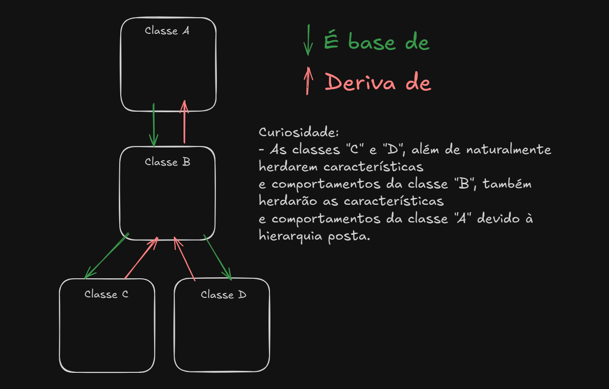
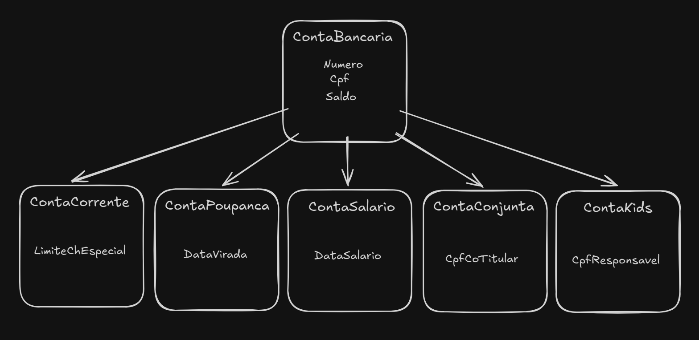
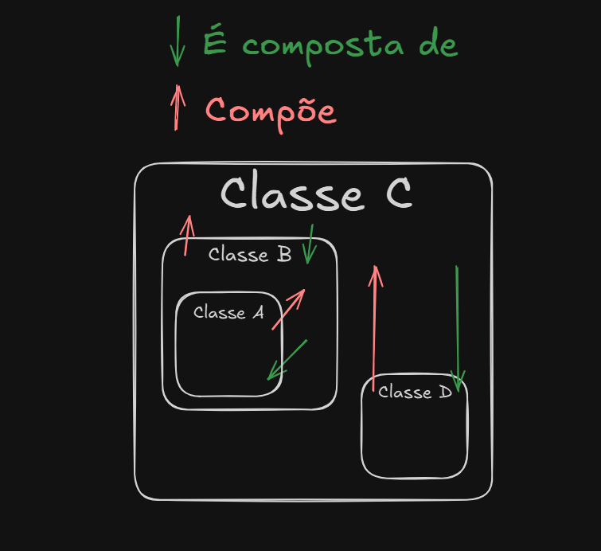

# Herança e composição

## Herança

A **herança**, também um pilar da programação orientada a objetos, possibilita que classes compartilhem suas características e comportamentos **em cadeia**. Isso funciona como um relacionamento esquematizado **hierarquicamente**, como representado na imagem abaixo.



Na herança temos estes dois tipos de classe principais:

- **Classe base / Superclasse / Classe mãe**: A classe que compartilha suas características e comportamentos com a outra(s) classe(s);
- **Classe derivada / Subclasse / Classe filha**: A classe que herda as características e comportamentos compartilhados pela(s) classe(s) "acima".

No uso da **Herança** uma classe derivada geralmente é a implementação de um caso mais especifico. Define somente características e comportamentos **especializados**.

Exemplificando, uma classe de `ContaBancaria` tende a ser uma classe mais genérica, pois uma conta poderia ser do tipo _corrente_, _poupança_, _salário_, _conjunta_ ou mesmo _kids_ — cada um desses tipos de conta pode ter um conjunto diferenciado de características e comportamentos condizentes com a sua categoria.

Nesse raciocínio, a classe `ContaBancaria` **teria apenas os dados compartilháveis entre todos os tipos de contas**, como por exemplo o número da conta, o CPF do primeiro titular e o saldo. As demais poderiam ter **especialidades**, como por exemplo:

- `ContaCorrente` poderia ter o **valor do limite de cheque especial**;
- `ContaPoupanca` poderia ter a **data de virada de rendimentos**;
- `ContaSalario` poderia ter a **data de depósito do salário**;
- `ContaConjunta` poderia ter o **CPF do co-titular**;
- `ContaKids` poderia ter o **CPF do responsável**.

Ficando mais ou menos assim:



Em código C#, simplificadamente:

```csharp
public class ContaBancaria {
    public int Numero { get; }
    public string Cpf { get; }
    public decimal Saldo { get; private set; }

    public ContaBancaria(string cpf) {
        Numero = /* Lógica de obtenção do próximo número disponível */;
        Cpf = cpf;
        Saldo = 0;
    }

    public bool Sacar(decimal valor) {
        /* Lógica de saque do saldo. */
    }

    public bool Depositar(decimal valor) {
        /* Lógica de depósito no saldo. */
    }
}

public class ContaCorrente : ContaBancaria {
    public decimal LimiteChEspecial { get; private set; }
    
    public ContaCorrente(string cpf) {
        base(cpf); // Chamando o construtor da classe base

        LimiteChEspecial = /* Lógica de obtenção do limite de cheque especial baseado no perfil do cliente */;
    }

    public bool SacarComUsoDoChEspecial(decimal valor) {
        /* Lógica de saque, mas agora considerando também o cheque especial. */
    }
}

public class ContaPoupanca : ContaBancaria {
    public Date DataVirada { get; private set; }
    
    public ContaPoupanca(string cpf, Date dataVirada) {
        base(cpf); // Chamando o construtor da classe base

        DataVirada = dataVirada;
    }

    public void GerarRendimentos() {
        /* Lógica de rendimentos com a data da virada. */
    }
}

public class ContaSalario : ContaBancaria {
    public Date DataSalario { get; private set; }
    
    public ContaSalario(string cpf, Date dataSalario) {
        base(cpf); // Chamando o construtor da classe base

        DataSalario = dataSalario;
    }

    public void PortarSalarioAutomaticamente() {
        /* Lógica de portabilidade automática de salário para outra conta na data estipulada. */
    }
}

public class ContaConjunta : ContaBancaria {
    public string CpfCoTitular { get; }
    
    public ContaConjunta(string cpfTitular1, string CpfTitular2) {
        base(cpfTitular1); // Chamando o construtor da classe base

        CpfCoTitular = CpfTitular2;
    }

    public bool LiberarSaque() {
        /* Lógica de liberação do saque mediante aprovação do co-titular. */
    }
}

public class ContaKids : ContaBancaria {
    public string CpfResponsavel { get; }
    
    public ContaKids(string cpf, string CpfResponsavel) {
        base(cpf); // Chamando o construtor da classe base

        CpfResponsavel = CpfResponsavel;
    }

    public bool LiberarSaque() {
        /* Lógica de liberação do saque mediante aprovação do responsável. */
    }
}
```

### Classes abstratas e interfaces

Agora recuperando o conteúdo aprendido em abstração, percebemos que a técnica de _consumo/implementação_ de classes abstratas ou interfaces através do uso de `:` é a mesma da herança, ou seja, **consumir uma classe base abstrata não deixa de ser também um tipo de herança**. Para interfaces não chamamos comumente de herança, a ideia de **implementação de contratos** permanece.

No nosso exemplo, `ContaBancaria` poderia inclusive se tornar uma classe abstrata, com os métodos `Sacar` e `Depositar` também abstratos, a serem **especializados** em cada caso:

```csharp
public abstract class ContaBancaria {
    public int Numero { get; }
    public string Cpf { get; }
    public decimal Saldo { get; private set; }

    public abstract bool Sacar(decimal valor);
    public abstract bool Depositar(decimal valor);
}

public class ContaCorrente : ContaBancaria {
    public decimal LimiteChEspecial { get; private set; }
    
    public ContaCorrente(string cpf) {
        Numero = /* Lógica de obtenção do próximo número disponível */;
        Cpf = cpf;
        Saldo = 0;
        LimiteChEspecial = /* Lógica de obtenção do limite de cheque especial baseado no perfil do cliente */;
    }
    
    // Esse método deixa de ser necessário, pois tudo pode ser implementado dentro de Sacar
    // public bool SacarComUsoDoChEspecial(decimal valor) { }

    public override bool Sacar(decimal valor) {
        /* Lógica de saque, mas agora considerando também o cheque especial. */
    }

    public override bool Depositar(decimal valor) {
        /* Lógica de depósito no saldo. */
    }
}
```

Assim `ContaBancaria` não poderia mais ser instanciada diretamente, e toda e qualquer conta concreta que a herdasse precisaria implementar os métodos `Sacar` e `Depositar`.

Agregando novamente o conceito de contratos no mesmo exemplo, poderíamos criar uma interface `IContaComRendimento` para estipular a necessidade de um comportamento de gerar rendimentos:

```csharp
public interface IContaComRendimento {
    void GerarRendimentos();
}

public abstract class ContaBancaria {
    public int Numero { get; }
    public string Cpf { get; }
    public decimal Saldo { get; private set; }

    public abstract bool Sacar(decimal valor);
    public abstract bool Depositar(decimal valor);
}

public class ContaPoupanca : ContaBancaria, IContaComRendimento {
    public Date DataVirada { get; private set; }
    
    public ContaPoupanca(string cpf, Date dataVirada) {
        Numero = /* Lógica de obtenção do próximo número disponível */;
        Cpf = cpf;
        Saldo = 0;
        DataVirada = dataVirada;
    }

    public override bool Sacar(decimal valor) {
        /* Lógica de saque no depósito. */
    }

    public override bool Depositar(decimal valor) {
        /* Lógica de depósito no saldo. */
    }

    // Agora esse método tem existência obrigatória para cumprir o contrato de IContaComRendimento
    public void GerarRendimentos() {
        /* Lógica de rendimentos com a data da virada. */
    }
}
```

> Nota: Devido a restrições de design da linguagem C#, é permitido:
>
> - 1 Herança por nível de hierarquia (classes concretas ou abstratas):
>
> ```csharp
> public class ContaPoupanca : ContaBancaria // Ok.
> public class ContaPoupancaKids : ContaBancaria, ContaPoupança // Erro.
> ```
>
> - N Implementações de interfaces por nível de hierarquia:
>
> ```csharp
> public class ContaPoupanca : IContaComRendimento // Ok.
> public class ContaPoupancaKids : IContaComRendimento, IContaComResponsavelM18 // Ok.
> ```
>
> - Uso conjunto do 1 + N:
>
> ```csharp
> public class ContaPoupanca : ContaBancaria, IContaComRendimento // Ok.
> public class ContaPoupancaKids : ContaBancaria, IContaComRendimento, IContaComResponsavelM18 // Ok.
> ```
>

## Extra: Alternativa à herança: composição

Enquanto a **herança** define que uma classe derivada _é um tipo de_ outra classe (o que pode ocasionar alguns efeitos colaterais indesejados no código fonte devido às ligações de hierarquia direta), a **composição** resolve o problema de **reutilização de código sem precisar criar uma hierarquia rígida**.

Em outras palavras, ao invés de dizer: uma `ContaCorrente` **é uma** `ContaBancaria`, podemos dizer: uma `ContaCorrente` **tem uma** `ContaBancaria` como parte de si. Isso, a primeira vista pode parecer estranho, mas para efeitos de código, é um tipo de **encapsulamento** que pode ser muito útil.

Um racional visual seria mais ou menos assim:



Exemplo:

```csharp
public class ContaBancaria {
    public int Numero { get; }
    public string Cpf { get; }
    public decimal Saldo { get; private set; }

    public ContaBancaria(string cpf) {
        Numero = /* Lógica de obtenção do próximo número disponível */;
        Cpf = cpf;
        Saldo = 0;
    }

    public bool Sacar(decimal valor) {
        /* Lógica de saque do saldo. */
    }

    public bool Depositar(decimal valor) {
        /* Lógica de depósito no saldo. */
    }
}

public class ContaCorrente { // Não temos mais herança, mas vamos encapsular uma instância de "ContaBancaria" dentro da instância de "ContaCorrente".
    private ContaBancaria _contaBancaria;
    public decimal LimiteChEspecial { get; private set; }

    public decimal Saldo { get { return _contaBancaria.Saldo; } }; // Acesso delegado de saldo da ContaBancaria.
    
    public ContaCorrente(string cpf) {
        _contaBancaria = new ContaBancaria(cpf);

        LimiteChEspecial = /* Lógica de obtenção do limite de cheque especial baseado no perfil do cliente. */;
    }

    public bool Sacar(decimal valor) {
        return _contaBancaria.Sacar(valor); // Delegando a ação para ContaBancaria.
    }

    public bool Depositar(decimal valor) {
        return _contaBancaria.Depositar(valor); // Delegando a ação para ContaBancaria.
    }
}
```

## [Exercícios](02-exercicios.md)
